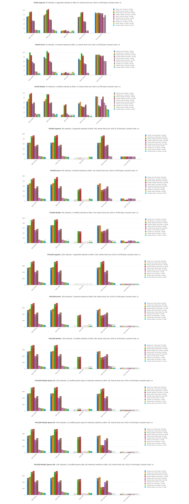

# Chunking stability benchmark

Webpack (browser) based benchmark for two content defined chunking algorithms: `fastcdc` and `buzhash`. For efficiency the chunking module is written in [rust](https://github.com/dstanesc/wasm-chunking-eval) and compiled in web assembly

The project uses [synthetic material data](https://www.npmjs.com/package/@dstanesc/fake-material-data) for data generation and [store-chunky-bytes](https://www.npmjs.com/package/@dstanesc/store-chunky-bytes) for persisting chunked byte arrays. The chunking library is [wasm-chunking-webpack-eval](https://www.npmjs.com/package/@dstanesc/wasm-chunking-webpack-eval) 

The binary data is derived from the material libraries in several ways:  
- [json text encoded](https://developer.mozilla.org/en-US/docs/Web/API/TextEncoder), 
- combined json text plus [base64 encoded](https://www.npmjs.com/package/base64-js), 
- [msgpack encoded](https://www.npmjs.com/package/msgpackr), 
- combined msgpack encoded plus [LZ4 compressed](https://www.npmjs.com/package/lz4) 
- combined msgpack encoded plus LZ77+Huffman (aka [pako](https://www.npmjs.com/package/pako)) compressed

Each (encoding, chunking algorithm) pair is evaluated.

## Method

The test bench uses three material payloads: 30, 300 and 1200 materials library, corresponding to roughly 1.5 MiB, 13.5 MiB and 55 MiB in binary footprint. 

The test is `performing content-defined-chunking` on both original library and the modified library and compares the resulting blocks. The goal is to identify the block reuse between the original data set and the modified data set for the various inputs.

Each library is modified in three different ways:
- Append 3 materials at the end
- Insert 3 materials in the middle
- Update (replace) 3 materials in the middle

The benchmark is also evaluating sparse updates. For statistical relevance only on the largest material library is evaluated.

- Update 10 materials, starting at index 10 and skipping intervals of 10 (sparsity 10)
- Update 10 materials, starting at index 10 and skipping intervals of 50 (sparsity 50)
- Update 10 materials, starting at index 10 and skipping intervals of 100 (sparsity 100), which is more or less distributing changes evenly across the entire material library

The chunking config is maintained the same for all tests.

## Findings

__The good__

1. Both _FastCDC_ and _Buzhash_ display a remarkable reuse behavior on json and serialized (_msgpack_ encoded) data. 
2. One surprising insight is that _LZ4_ compression is also preserving a very good reusability rate, almost equivalent with the json and serialized data. 
3. Sparse modifications (see bottom charts) applied to _json_, _msgpack_ and _LZ4_ data formats also manifest very good reusability 

__The bad__

4. CDC on the _LZ77+Huffman_ compression format (ie. _Pako_) shows NO ability to reuse blocks
5. _Base64_ encoding also collapses the reusability rate


## Execute Benchmark

```
npm run clean // optional
npm install
npm run build
npm start
```

A browser page will open and guide the execution.

##  Example Results



